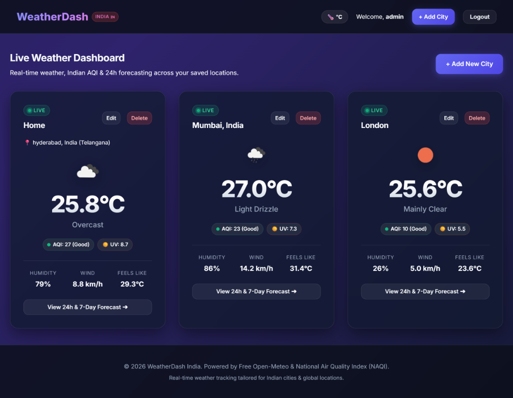
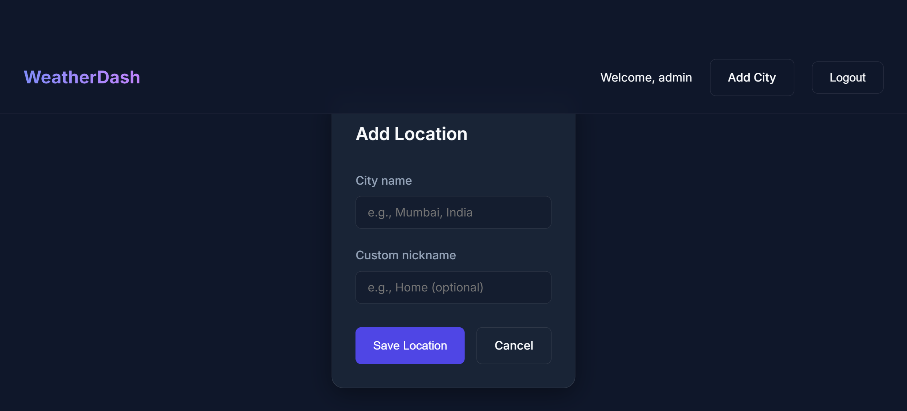

# WeatherDash India 🇮🇳

A modern, full-stack Python Django Weather Dashboard tailored for Indian and global cities, powered by **100% Free Open-Meteo & National Air Quality Index (NAQI) APIs** (zero API keys required out-of-the-box!), featuring real-time meteorological metrics, 24-hour hourly projections, 7-day extended forecasts, and dynamic animated atmospheric elements wrapped in a stunning dark-mode glassmorphism UI.



## About The Project
WeatherDash India provides a personalized, fast, and visually captivating experience for tracking live weather and air quality across major Indian hubs (such as Hyderabad, Mumbai, Delhi NCR, Bengaluru, Chennai, and Kolkata) as well as any city worldwide.

### 🌟 Key Features
* **100% Free API (Zero Setup / No API Key Needed)**: Powered by Open-Meteo with zero rate limit obstacles or key activation delays. Real live weather data works immediately upon running.
* **Indian National Air Quality Index (NAQI)**: Real-time AQI categorization (Good, Satisfactory, Moderate, Poor, Very Poor, Severe) with granular PM2.5, PM10, Ozone, and CO pollutant metrics.
* **Sun Cycle & Solar Arc Tracker**: Visual solar tracker displaying exact local sunrise and sunset timings.
* **Hourly & Extended Forecasting**: Granular 24-hour hourly slider with precipitation chances and a full 7-day extended forecast.
* **Interactive Unit Switcher**: Client-side instant toggle between Celsius (`°C`) and Fahrenheit (`°F`).
* **Indian Weather Context & Advisories**: Automated contextual weather advisories for heatwaves, monsoon downpours, high air pollution, or clear skies.
* **Quick-Add City Chips**: 1-click quick-fill badges for popular Indian metropolitan cities.
* **Premium Glassmorphic UI & Animations**: Ambient weather particles, glowing hover cards with light-sheen reflections, live pulsating status radar dots (`🟢 Live`), and smooth cascading entry animations built with pure Vanilla CSS.



## Demo Credentials
To test the application quickly without registering, use the default administrator account:
- **Username:** `admin`
- **Password:** `admin`

---

## Technical Architecture
- **Framework**: Django 5.2 (Python 3.10+)
- **Service Layer Pattern**: Decoupled `WeatherService` with robust geocoding, WMO weather interpretation code mapping, and air quality classification.
- **Fault-Tolerant Fallback**: Automatic graceful fallback ensures views never crash even during intermittent external network timeouts.
- **Frontend / Styling**: Semantic HTML5 and pure Vanilla CSS (no bulky external CSS frameworks) with CSS custom properties, backdrop filters, and keyframe animations.

---

## Setup & Installation

1. **Clone the repository**
   ```bash
   git clone https://github.com/ANAND-JATOTHU/kinetrexa-Weather-Dashboard.git
   cd kinetrexa-Weather-Dashboard
   ```

2. **Create and activate a virtual environment**
   ```bash
   python -m venv venv
   # On Windows:
   .\venv\Scripts\Activate.ps1
   # On macOS/Linux:
   source venv/bin/activate
   ```

3. **Install dependencies**
   ```bash
   pip install -r requirements.txt
   ```

4. **Run Migrations**
   ```bash
   python manage.py makemigrations
   python manage.py migrate
   ```

5. **Start the Development Server**
   ```bash
   python manage.py runserver
   ```
   Access the dashboard at **`http://127.0.0.1:8000`**.

---

## Generating the PDF Architecture Report
The project includes a standalone script to generate an architectural and database schema PDF report:
```bash
python generate_report.py
```
This generates `Project_Report.pdf` in the root directory.

---

## License
Developed for Kinetrexa Internship Project.
